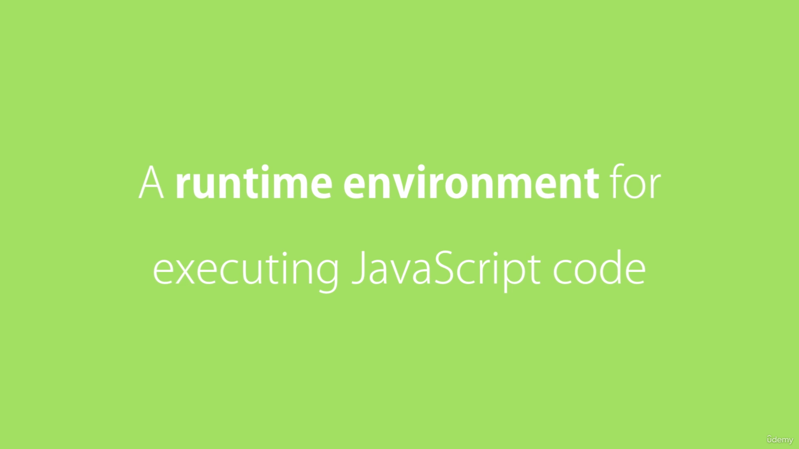
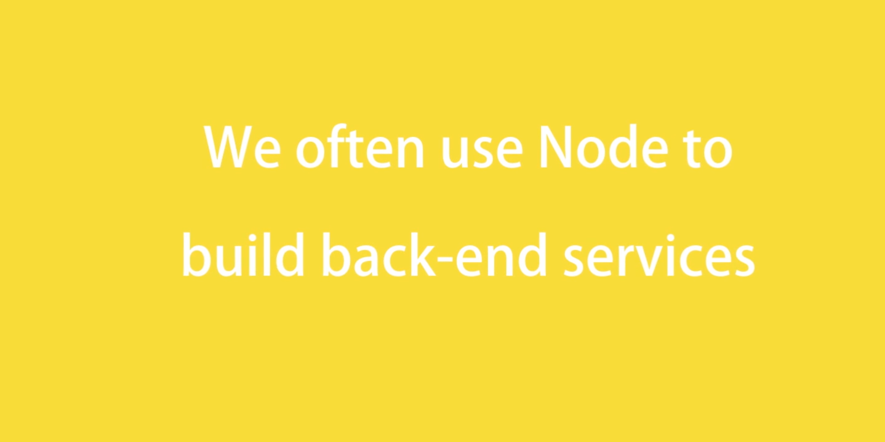
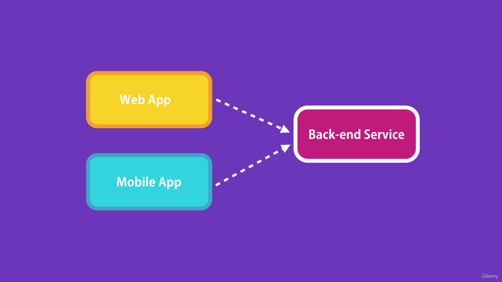
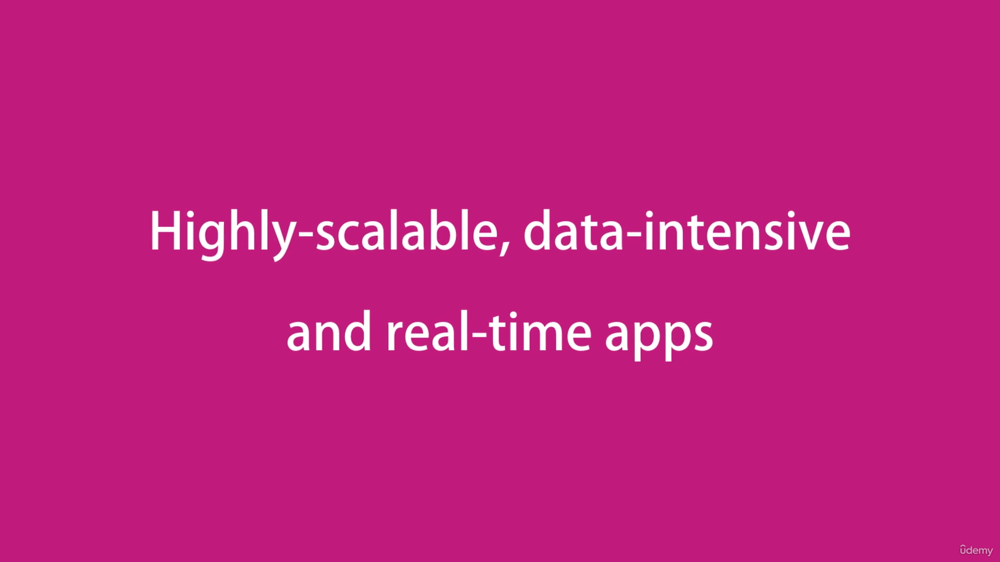
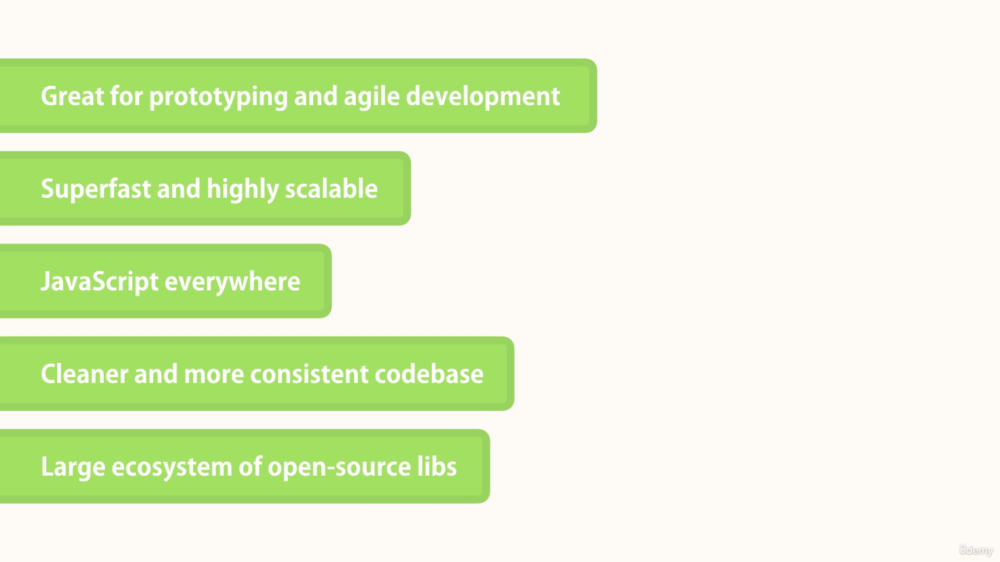
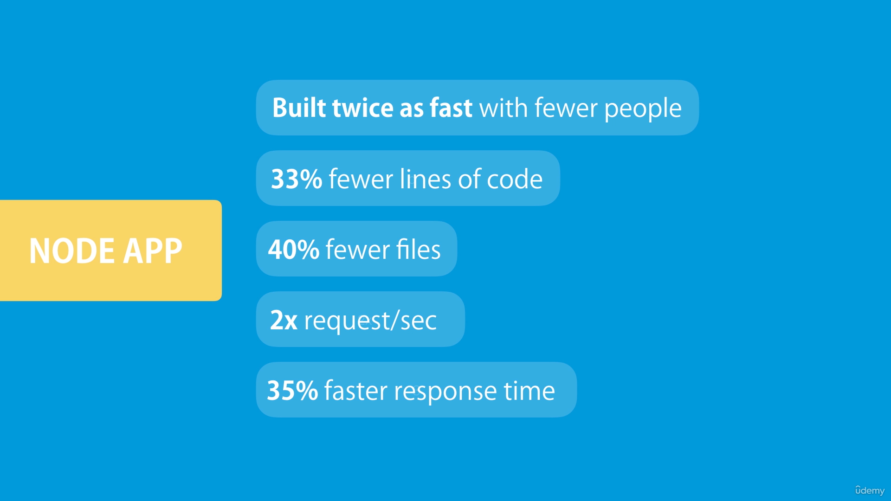

# Node
Node js or node, is an open source and cross platform run time environment for executing JavaScript code outside of a browser. 

These are the services that power our client applications. 

Like a web app running inside of a web browser, or a mobile app running on a mobile device. These client apps are simply what the user sees and interacts with. They are just a surface. They need to talk to some services sitting on the server or in the cloud to store data, send emails, push notifications and so on. 

Node is ideal for building highly-scalable, data-intensive and real-time back end services that power our client applications. 

---

## How node is different from other frameworks ?

1. Node is easy to get started and can be used for prototyping and agile development.

2. It can also be used for building super fast and highly scaleable services. It's used in production by large companies such as PayPal, Uber, Netflix, Walmart, and so on.In fact, at PayPal, they rebuilt one of their Java and Spring based applications using Node, and found that the Node applications was built twice as fast with fewer people
in 33% fewer lines of codes and 40% fewer files. And more importantly, they double the number of requests served per second, while decreasing the average response time by 35%, so
Node is an excellent choice for building highly scaleable services.

3. In Node applications, we use JavaScript, so if you're a front end developer and know JavaScript, you can reuse your JavaScript skills and transition to a full stack developer, and get a better job with better pay. You don't have to learn a new programming language. 

4. You can use JavaScript both on the front end and on the back end, your source code will be cleaner and more consistent, so you would use the same naming convention, the same tools and the same best practices.

5. Node has the largest ecosystem of open-sourced libraries available to you. So, for pretty much any features or building blocks you want to add to your application, there is some free open sourced library out there that you can use.
So, you don't have to build these building blocks from scratch, and instead you can focus on the core of your application.

---

