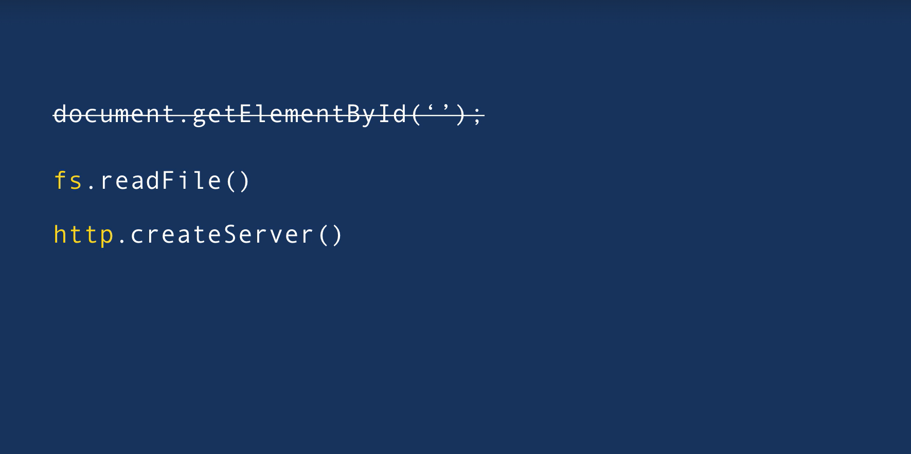

# Node Architecture

Before Node we used JavaScript only to build applications that run inside a browser. 

So every browser has a JavaScript engine that takes our code and converts into code that a computer can understand. 

For example, Microsoft Edge uses Chakra, Firefox uses SpiderMonkey and Chrome uses v8. Because of these varieties of engines, that sometimes JavaScript codes can behave differently in one browser or another.

The browser provides a runtime environment for JavaScript code. For example, you probably know that in browsers, we have the window or the document object. These objects allow us to work with the environment in which our code is running. 

Upto 2009 only way to execute JavaScript code was inside of a
browser. In 2009, Ryan Dahl, the creator of Node came up with a brilliant idea. He thought it would be great to execute JavaScript outside of a browser, so he took Google's v8 engine, which is the fastest JavaScript engine out there, and embedded it inside a C++ program and called that program Node. 

So similar to a browser, Node is a runtime environment for JavaScript code. It contains a JavaScript engine that can execute our JavaScript code.

Node has certain objects that provide an environment for our JavaScript code but these objects are different from the environment objects we have in browsers. For example, we don't have the document object instead we have other objects that give us more interesting capabilities. For example, we can work with the file system, listen for requests in a given port, and so on. We can't do stuff like that inside of a browser. 

So in essence, Node is a program that includes a v8 JavaScript engine plus some additional modules that give us capabilities not available inside browsers. We can work with a file system or the network and so on. 

## Node is neither a programming language nor a framework.

Often people compare Node to C# or Ruby, or some other programming languages, but these comparisons are fundamentally wrong, because Node is not a programming language, its like comparing a car with an apple.

By the same token, Node should not be compared with frameworks such as ASP.NET, or Rails, or Django, and so on. 
These are frameworks for building web applications. Node
is NOT a framework, it is a runtime environment for executing
JavaScript code.

----