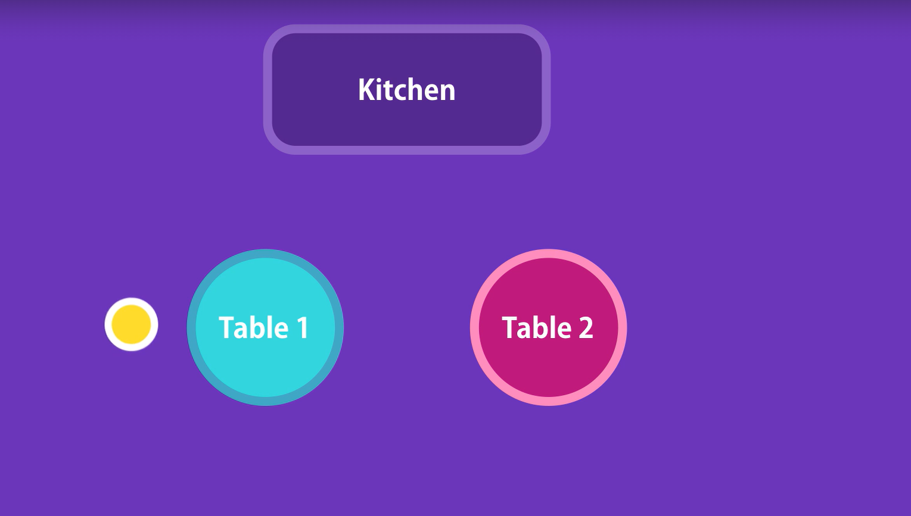
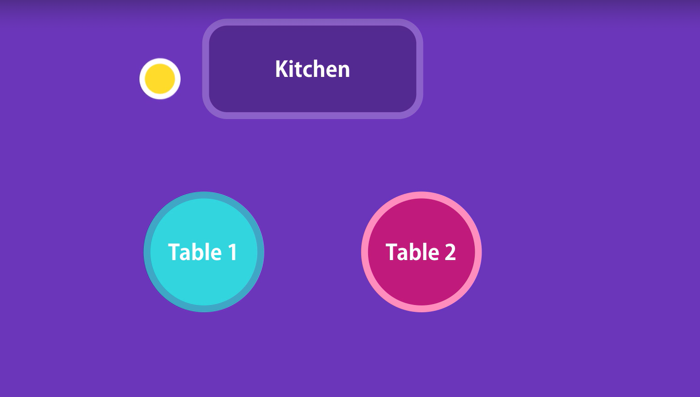
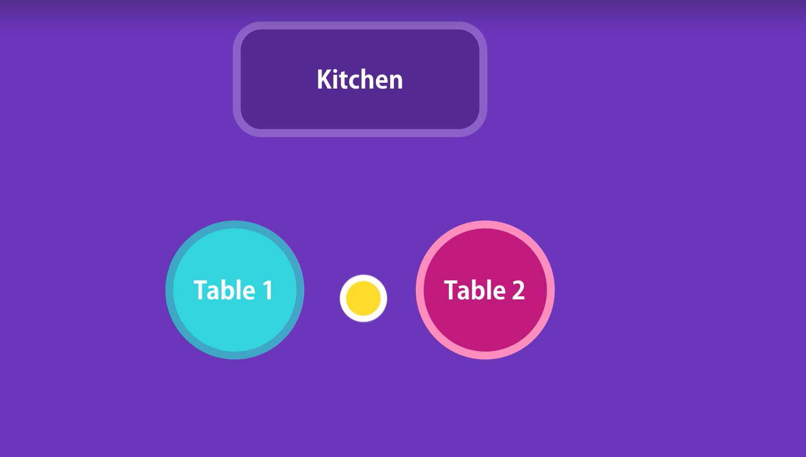
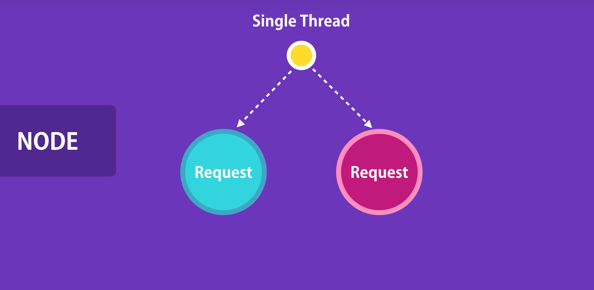
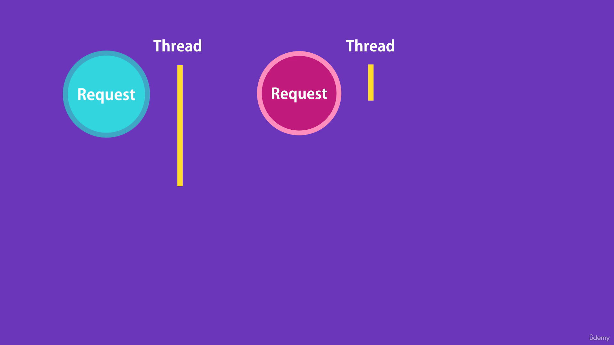
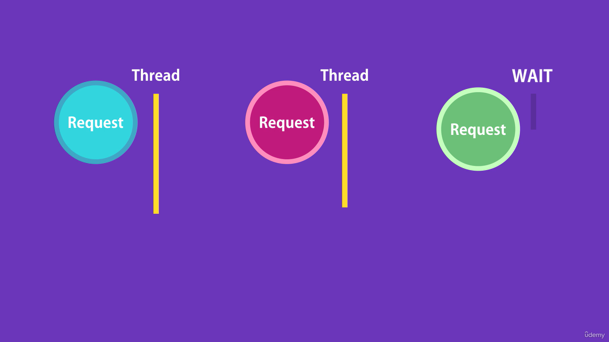
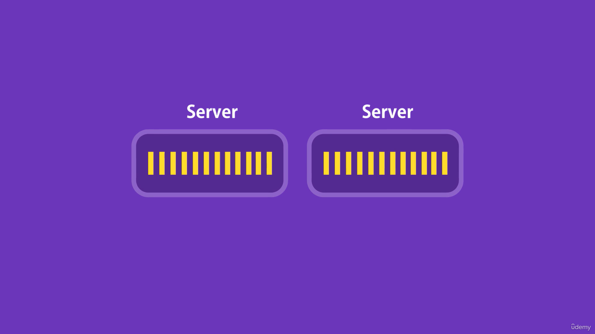
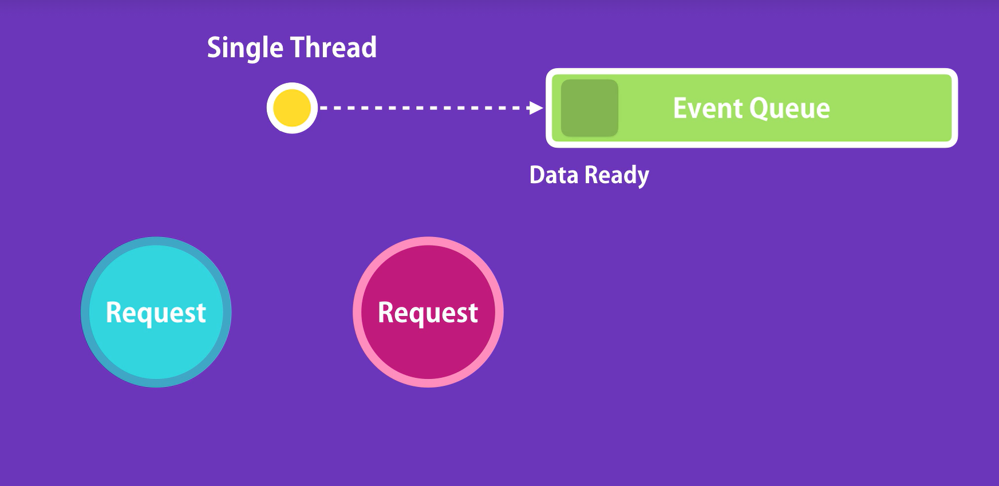

# How does node work?

Node applications are highly-scalable and this is because of the non-blocking, or asynchronous nature of Node. 

Imagine you go to a restaurant. A waiter comes to your table, takes your order, and gives it to the kitchen.

Then, He moves onto serve another table while the chef is preparing your meal. So the same person can serve many different tables. He does not have to wait for the chef to cook one meal before they serve another table. This is what we call non- blocking or asynchronous architecture. This is how Node applications work. 

The waiter is like a thread allocated to handle a request. So a single thread is used to handle multiple requests. 

In contrast to non-blocking or asynchronous architecture. We have blocking or synchronous architecture. 

Let's see how that works. So, back to our restaurant example, imagine you go to another restaurant and in this restaurant a waiter is allocated to you. They take your order, and give it to the kitchen, now they are sitting in the kitchen waiting for the chef to prepare your meal. At this time they are not doing anything else, they're just waiting. They're not going to take an order from another table until your meal is ready. This is what we call blocking, or sychronous architecture. 

That's how applications built with frameworks like ASP.NET or Rails work out of the box. 

So when we receive a request on the server a thread is allocated to handle that request. As part of handling that
request, it is likely that we're going to query a database, and as you know sometimes it may take a while until the result is ready. When the database is executing the query, that thread is sitting there, waiting. It can't be used to serve another client. 

So, with a new thread to serve another client. 

Now imagine what would happen if we have a large number of concurrent clients, at some point, we're going to run out of threads to serve these clients. 

So, new clients have to wait until three threads are available. 

If we don't want them to wait, we want them to add more hardware. 

So with this kind of architecture, we are not utilizing our resources efficiently. This is the problem with blocking or synchronous architecture and that's how applications built with frameworks like ASP.NET work by default.

Although in ASP.NET it is possible to use asynchronous architecture, but you will have to do extra work for that. In
contrast, Node applications are asynchronous by default.
So, you don't have to do anything extra. 

In Node, we have a single thread to handle all requests. When a request arrives, that single thread is used to handle that request. 

If we need to query a database, our thread doesn't have to wait for the database to return the data. While the database is executing our query, that thread will be used to serve another client. 

When the database prepares the result. It puts a message in what we call an event queue. Node is consistently monitoring this queue in the background. When it finds an event in this queue it will take it out and process it. 

This kind of architecture makes Node ideal for building applications that include a lot of disk or network access. We can serve more clients without the need to throw in more hardware. And that's why Node applications are highly scaleable. 

In contrast, Node should not be used for CPU-intensive applications like video encoding or an image manipulation service. In these kind of applications, we have a lot of calculations that should be done by CPU, and few operations that touch the file system or the network.

Since Node applications are single threaded, when performing the calculations to serve one client, other clients have to wait, and that's why Node should not be used for CPU intensive applications. It should only be used for building data intensive and real time applications. 

---