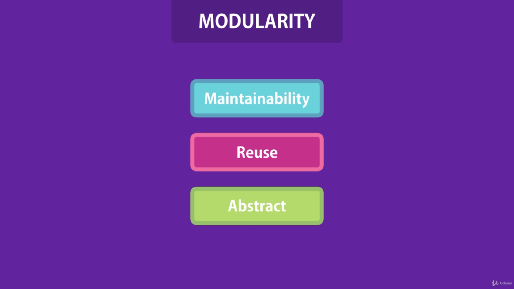
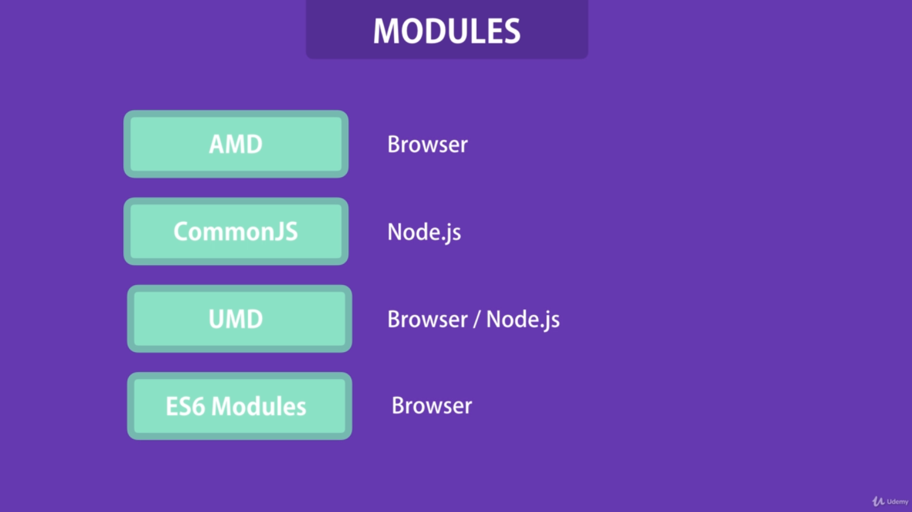

# Modules
Module is a library or a set of reusable functions that we use in our application. 


we don't want one gigantic file with hundreds and thousands lines of code. It is really hard to maintain. So, we should split our code into multiple files called as Modules. 

---

## Benifits of Modularity



1. It helps in maintainability of our application. 
2. We can reuse same code in different parts of application. 
3. We can apply the abstraction. We can hide the implementation details and only expose the essentials. 

---

## Popluar Module Formats



1. AMD stands for Asynchronous Modular Definition
2. UMD stands for Universal Modular Definition

---

## CommonJS Modules

Let's create a file operations.js
~~~js
module.exports.add = (a, b)=> a + b;

module.exports.subtraction = (a, b)=> a - b;

module.exports.division = (a, b)=> a / b;

module.exports.multiplication = (a, b)=> a * b;

~~~

```module.exports.property ``` is the keyword we use to declare all we want to export from that file.

To use these functions in our index.js file, we can do it like this:

~~~js
const operations = require('./operations');

const result1 = operations.add(2, 3); // 5

const result2 = operations.subtraction(9, 3); // 6

const result3 = operations.division(12, 3); // 4

const result4 = operations.multiplication(9, 3); // 27
~~~

We declare whatever we want to use and then assign that to the require of the file we want to use. 

Alternatively we can also export like this in operations.js :

~~~js
const add = (a, b)=> a + b;

const multiplication = (a, b)=> a * b;

const subtraction = (a, b)=> a - b;

const division = (a, b)=> a / b;

module.exports = { add, multiplication, subtraction, division };
~~~

---

## ES6 Modules

ESmodules is a more modern approach that is currently supported by browser and server-side apps with Node.

Let's see this in code. Once again we start by creating a Node app with npm init -y.

Now we go to our package.json and add "type": "module" to it, like this:

~~~js
{
  "name": "modulestestapp",
  "version": "1.0.0",
  "description": "",
  "main": "index.js",
  "scripts": {
    "test": "echo \"Error: no test specified\" && exit 1"
  },
  "keywords": [],
  "author": "",
  "license": "ISC",
  "type": "module"
}
~~~

Let's create a file operations.js

~~~js
 export const add = (a, b)=> a + b;

export const subtraction = (a, b)=> a - b;

export const division = (a, b)=> a / b;

export const multiplication = (a, b)=> a * b;

~~~
Alternatively we can also export like this in operations.js :
~~~js

const add = (a, b)=> a + b;

const multiplication = (a, b)=> a * b;

const subtraction = (a, b)=> a - b;

const division = (a, b)=> a / b;

export { add, multiplication, subtraction, division };
~~~

index.js 

~~~js

import { add, multiplication, division, subtraction } from './operations.js';

console.log(add(2, 3)); //5

console.log(division(12, 3)); //4

console.log(multiplication(2, 3)); //6

console.log(subtraction(10, 3)); //7
~~~

Notice instead of require we're using import and instead of module.exports we're using export. The syntaxt is a bit different but the behaviour is very similar.

Another thing you could do is import all exports together and put them together in an object, like this in index.js:

~~~js

import * as operations from './operations.js';

console.log(operations.add(2, 3)); //5

console.log(operations.division(12, 3)); //4

console.log(operations.multiplication(2, 3)); //6

console.log(operations.subtraction(10, 3)); //7
~~~

The last thing worth mentioning is the default keyword. With it we can set a default export for a given module. Like this in operation.js :

~~~js
const add = (a, b)=> a + b;

const multiplication = (a, b)=> a * b;

const subtraction = (a, b)=> a - b;

const division = (a, b)=> a / b;

export default add;
export { multiplication, subtraction, division };
~~~

or 

~~~js

export const add = (a, b)=> a + b;

export const multiplication = (a, b)=> a * b;

export const subtraction = (a, b)=> a - b;

export const division = (a, b)=> a / b;

export default add;
~~~

index.js

~~~js

import add, { division, subtraction, multiplication } from './operations.js';

console.log(add(2, 3)); //5

console.log(division(12, 3)); //4

console.log(multiplication(2, 3)); //6

console.log(subtraction(10, 3)); //7

~~~

---

## How require works ??
The actual loading of any module using ```require()``` happens in five steps:

1. Resolving: It gets the absolute path of the module.

2. Loading: It loads the module.

3. Wrapping: It give as separate scope to your variables.

4. Evaluating: It is what the VM(usually V8)eventually does with the code.

5. Caching: It caches the module in case we use it again.

---