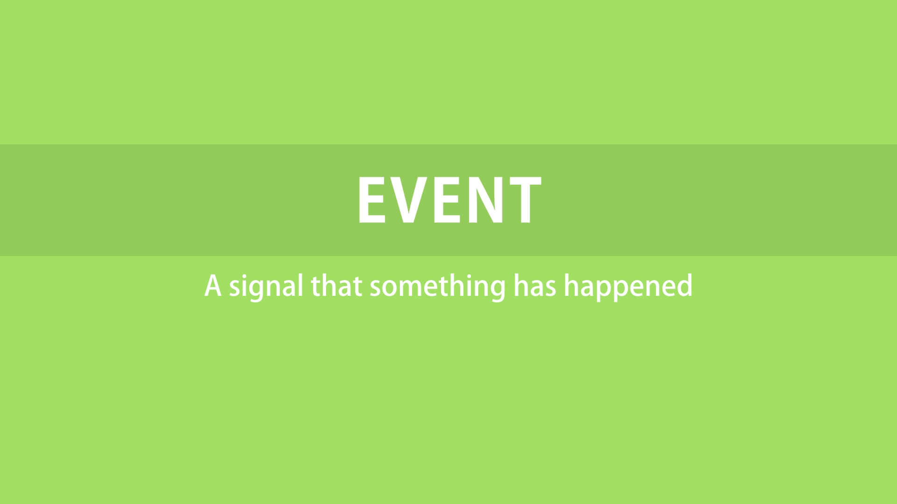
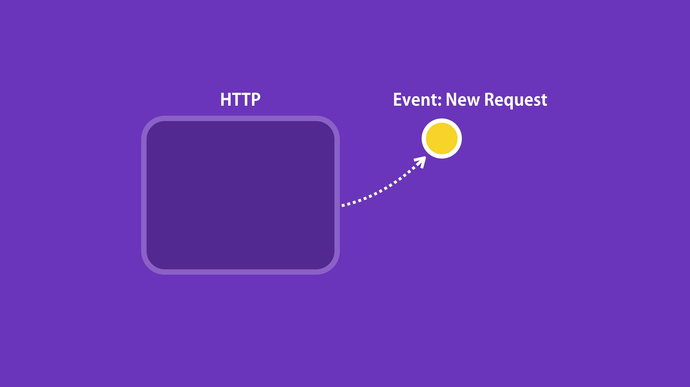

# Events Module

Lot of core functionality of Node.js is based on events. An event is a signal that indicates something has happened. 

In Node we have a class HTTP which is used to build web server. So, we listen on a given port. Everytime we receive a request on that port, the HTTP class raises an event. Our job is to respond to that event which involves reading the request and returning the right response.   

~~~js

const EventEmitter = require('events');

const emitter = new EventEmitter();

//Register a listener
emitter.on('messageLogged', ()=>
{
    console.log('Listener called');
})

//Raise an event
emitter.emit('messageLogged');

~~~

# Event Arguments

~~~js

const EventEmitter = require('events');

const emitter = new EventEmitter();

//Register a listener
emitter.on('messageLogged', (args)=>
{
    console.log('Listener called', args);
})

//Raise an event
emitter.emit('messageLogged', { id: 1, name : 'anubhav' });

~~~

# Extending Event Emitter

~~~js

const EventEmitter = require('events');

class Logger extends EventEmitter
{
    log(message)
    {
        this.emit(message, { id: 1, name : 'anubhav' });
    }
}

const logger = new Logger();

logger.on('messageLogged', (args)=>
{
    console.log('Listener called', args);
})

logger.log('messageLogged');

~~~