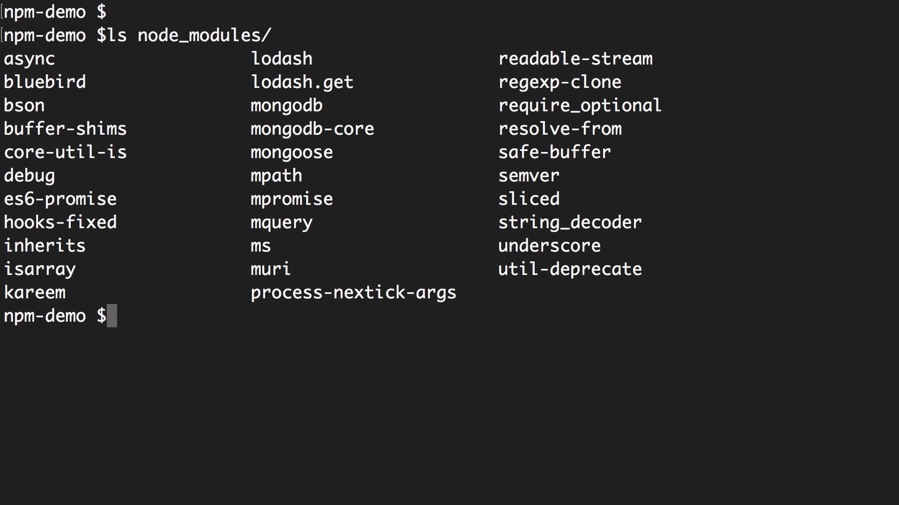

# Package.json
~~~
Package.json is basically a json file that includes some basic information about your application or your project, such as it's name, it's version, it's authors, the address of its git repository, its dependencies and so on. It's basically a bunch of metadata about your application. All Node applications by standard have this package.json file. 
~~~
---
## Command for creating package.json
~~~
1. npm init
2. npm init --yes
~~~
---

## Installing a node package
~~~
1. npm install package
2. npm i package 
~~~

----

## Installing a node package globally
~~~
1. npm install -g package
2. npm i -g package
~~~

----

## Package Dependencies



We only installed Mongoose and underscore. So, these other libraries, these are other Node packages that Mongoose is dependent upon. 

---

## Semantic Versioning

~~~
Major.Minor.Patch

1. Patch Version: It is for bugs-fixing.

2. Minor Version: Adding new features that do not break the existing API

3. Major Version: If any feature breaks the existing API. 
~~~

```js
"mongoose" : "^4.13.6" //4.x

"mongoose" : "~4.13.6" //4.13.x
```
---
## npm outdated

This command tells about the current version, the version we want and the latest version of the package. 

---
## npm update

This command updates the minor version and patch version. 

---

## Dev Dependencies

In package.json file, there is an object called as dev Dependencies and it consists of all the packages that are used in the project in its development phase and not in the production or testing environment with its version number. So, whenever you want to install any library that is required only in your development phase then you can find it in the dev Dependencies object. 

~~~
npm install <package name> --save-dev
~~~

---

## Dependencies

In package.json file, there is an object called dependencies and it consists of all the packages that are used in the project with its version number. So, whenever you install any library that is required in your project that library you can find it in the dependencies object. 

---