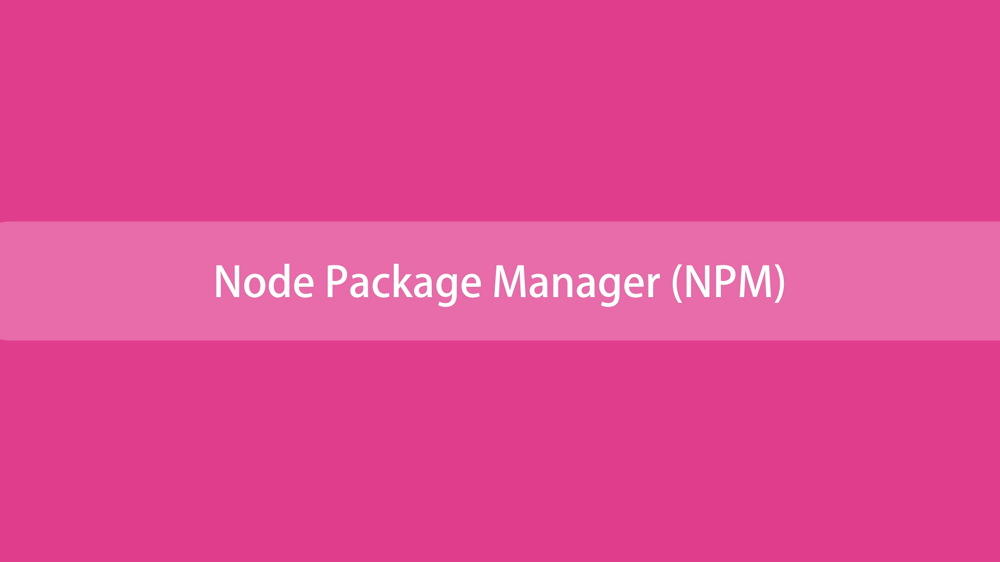

# **Node Package Manager**


NPM is basically a command line tool as well as a registry of third party libraries that we can add to our Node applications. 

So for pretty much any kind of functionality you want to add to your application there is most likely a free, open sourced library or package or node module, whatever you wan to call it on NPM registry.

In September 2022 over 2.1 million packages were reported being listed in the npm registry, making it the biggest single language code repository on Earth, and you can be sure there is a package for (almost!) everything.

It started as a way to download and manage dependencies of Node.js packages, but it has since become a tool used also in frontend JavaScript.

~~~
Yarn and pnpm are alternatives to npm cli. You can check them out as well.
~~~

# **Packages**
npm manages downloads of dependencies of your project.

## **Installing all dependencies**
If a project has a package.json file, by running

~~~
npm install
~~~

It will install everything the project needs, in the node_modules folder, creating it if it's not existing already.

## **Installing a single package**
You can also install a specific package by running

~~~
npm install <package-name>
~~~

Furthermore, since npm 5, this command adds <package-name> to the package.json file dependencies. Before version 5, you needed to add the flag --save.

Often you'll see more flags added to this command:

* --save-dev installs and adds the entry to the package.json file devDependencies
* --no-save installs but does not add the entry to the package.json file dependencies
* --save-optional installs and adds the entry to the package.json file optionalDependencies
* --no-optional will prevent optional dependencies from being installed

Shorthands of the flags can also be used:

* -S: --save
* -D: --save-dev
* -O: --save-optional

The difference between devDependencies and dependencies is that the former contains development tools, like a testing library, while the latter is bundled with the app in production.

As for the optionalDependencies the difference is that build failure of the dependency will not cause installation to fail. But it is your program's responsibility to handle the lack of the dependency.

# **Updating packages**

Updating is also made easy, by running

~~~js
npm update
~~~

```npm``` will check all packages for a newer version that satisfies your versioning constraints.

You can specify a single package to update as well:

~~~js
npm update <package-name>
~~~

# **Versioning**

In addition to plain downloads, ```npm``` also manages **versioning**, so you can specify any specific version of a package, or require a version higher or lower than what you need.

Many times you'll find that a library is only compatible with a major release of another library.

Or a bug in the latest release of a lib, still unfixed, is causing an issue.

Specifying an explicit version of a library also helps to keep everyone on the same exact version of a package, so that the whole team runs the same version until the ```package.json``` file is updated.

In all those cases, versioning helps a lot, and ```npm ```follows the semantic versioning (semver) standard.

You can install a specific version of a package, by running

~~~js
npm install <package-name>@<version>
~~~

# **Running Tasks**

The package.json file supports a format for specifying command line tasks that can be run by using

~~~
npm run <task-name>
~~~

For example:

~~~js
{ "scripts": { start": "node index.js" } }
~~~

So instead of typing those long commands, which are easy to forget or mistype, you can run

~~~
npm run start
~~~

