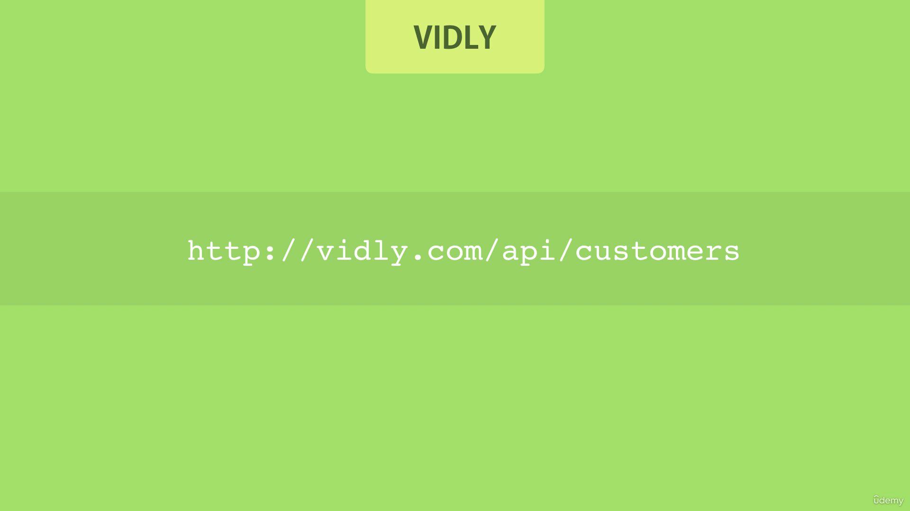
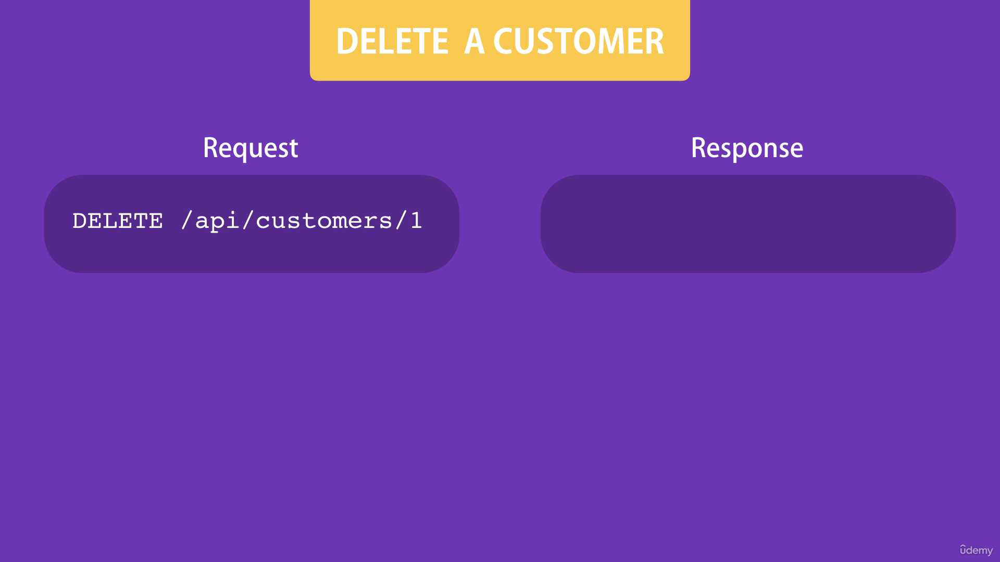

# RESTful Services

All applications we use these days follow the client-server architecture. The app itself is the client or the front end part. It needs to talk to the server or the backend to get or save the data. This communication happens using the http protocol. The same protocol that powers our app. 

So on the server we expose a bunch of services that are accessible via the http protocol. The client can then directly call these service by sending http requests. 

This is where rest comes into the picture. 

REST is short for Representational State Transfer. REST is basically a convention for building these http services. 

So we use simple http protocol principles to provide support to create read update and delete data. 

We refer to these operations all together as CRUD operations. 

Now let's explore this convention using a real world example. 

Let's say we have a company called Vidly for renting out movies. We have a client app where we manage the lists of our customers. 

On the server, we should expose a service and an endpoint like this.  

~~~html
http://vidly.com/api/customers
~~~

So the client can send http requests to this endpoint to talk to our service. 

Now a few things about this endpoint you need to know. 

1. The address can start with http, or https. That depends on the application and it's requirements. If you want the data to be exchanged on a secure channel, you would use https. 

2. After that we have the domain of the application.

3. Next we have/api. This is not compulsory, but you see a lot of companies follow this convention to expose their RESTful services. They include the word API somewhere in the address. It can be after the domain or it can be a subdomain like api.vidly.com. There is no hard and fast rule. 

4. After that we have /customers which refers to the collection of customers in our application. 

In the REST world we refer to this part as a resource. We can expose our resources such as customers movies, rentals, and various endpoints. So this is our endpoint to work with the customers. 

All the operations around customers, such as customers, updating a customer, would be done by sending an http request to this endpoint.

The type of the http request determines the kind of operation. So every http request has what we call a verb or a method that determines its type of intention. 

The standard http methods are

1. Get for getting data.

2. Post for creating data.

3. Put for updating data.

4. Delete for deleting data.

To get the list of all customers we should send am http get requests to your address. Note the full name of customers here. It indicates a list of customers. So when we send an http get request to this endpoint, our service should send us something like this. So we have an array of customer objects. 

If you want a single customer, you should include the ideal (1) of that customer in the address. Then our server would respond to the customer object like this. 

~~~js
 { id : 1, name: `` }
~~~

Now, to update a customer we should send an http put request to this endpoint, and note that again here, we are specifying the idea of the customer to the data. But also we should note the customer object in the body of the request. 
So this is a complete representation of the customer object with updated properties. They send this to the server, and the server updates the customer with a given ID according to these values. 

Similarly to delete a customer, we should send an http delete request to this endpoint, but here we don't need to include the customer object in the body of the request, because all we need to delete the customer is an ID. 

Finally to create a customer we need to send an http post request to this endpoint. Note that here because we are adding a new customer, we are not dealing with a specific customer, so we don't have an ID in the address, we are working with a collection of customers, so we are posting a new customer to this collection. That's why we should include the customer object in the body of the request. The server gets this objet and creates the customer for us. 

So this is the RESTful convention where we expose our resources such as customers using a simple, meaningful address, and support various operations around them, such as creating or updating them, using standard http methods.

---

