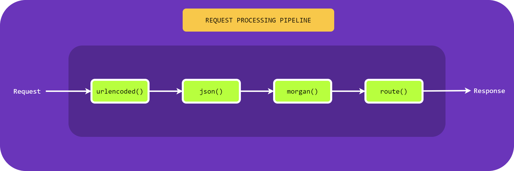

~~~js
const dotenv = require('dotenv');
dotenv.config();

const express = require('express');
const Joi = require('joi');
const morgan = require('morgan');
const helmet = require('helmet');

const app = express();

const hostname = 'localhost';
const port = process.env.PORT || 8000;

app.use(express.urlencoded({extended: true}));
app.use(express.json());
app.use(helmet());
app.use(morgan("dev"))

const courses = [
    { id: 1, name : "course 1" },
    { id: 2, name : "course 2" },
    { id: 3, name : "course 3" },
    { id: 4, name : "course 4" } 
]

// to get all the courses
app.get('/api/courses', (req, res)=>
{    
    res.send(courses);
})

// to get single course
app.get('/api/courses/:id', (req, res)=>
{    
    const course = courses.find((course)=> course.id === parseInt(req.params.id) );    
    if(!course)
    {
        return res.status(404).send('Course not found');
    }
    res.send(course);
})

// to add a course
app.post('/api/courses', (req, res)=>
{    
    const schema = Joi.object({ name: Joi.string().min(3).required() });
    const result = schema.validate(req.body);

    if(result.error)
    {
        res.status(400).send(result.error.details[0].message);
        return;
    }
    const course = {id: courses.length + 1, name: req.body.name };
    courses.push(course);
    res.send(course);

})

// to update a course
app.put('/api/courses/:id', (req, res)=>
{    
    const course = courses.find((course)=> course.id === parseInt(req.params.id) );    
    if(!course)
    {
        return res.status(404).send('Course not found');
    }

    const schema = Joi.object({ name: Joi.string().min(3).required() });
    const result = schema.validate(req.body);

    if(result.error)
    {
        res.status(400).send(result.error.details[0].message);
        return;
    }

    course.name = req.body.name;
    res.send(course);
})


// to delete a course
app.delete('/api/courses/:id', (req, res)=>
{
    const course = courses.find((course)=> course.id === parseInt(req.params.id) );    
    if(!course)
    {
        return res.status(404).send('Course not found');
    }

    const index = course.indexOf(course);
    courses.slice(index, 1);
    res.send(course);
});


//start the server
app.listen(port,hostname, function(err)
{
    if(err)
    {
        console.log(err);
        return; 
    }

    console.log(`Server is up and running at http://${hostname}:${port}`);
});
~~~

# **What Does ```app.use()``` do in Express?**

The ```app.use()``` function adds a new middleware to the app. Essentially, whenever a request hits your backend, Express will execute the functions you passed to ```app.use()``` in order. 

# **Using ```express.json([options])```**

```express.json()``` is a built in middleware function in Express starting from v4.16.0. It parses incoming JSON requests and puts the parsed data in ```req.body```.

# **Using ```express.urlencoded([options])```**

This is a built-in middleware function in Express. It parses incoming requests with urlencoded payloads and is based on body-parser.

A new body object containing the parsed data is populated on the request object after the middleware (i.e. ```req.body```), or an empty object ({}) if there was no body to parse, the Content-Type was not matched, or an error occurred. This object will contain key-value pairs.

# **Using the limit option**

The limit option allows you to specify the size of the request body. Whether you input a string or a number, it will be interpreted as the maximum size of the payload in bytes.

~~~js
app.use(express.urlencoded({ limit: '200kb' }));
app.use(express.json({ limit: '200kb' }));
~~~

# **extended option in ```app.use(express.urlencoded({extended: false}))```**

This option allows to choose between parsing the URL-encoded data with the querystring library (when false) or the qs library (when true). The "extended" syntax allows for rich objects and arrays to be encoded into the URL-encoded format, allowing for a JSON-like experience with URL-encoded.

# **```morgan("dev")```**

It adds basic logging to an express app. 

# **```req``` Object**

The first parameter to Express route handlers and middleware functions is the Express request object. This parameter is usually called req.

# **```res``` Object**

The 2nd parameter to Express route handlers and middleware functions is the Express response object, commonly called res. The res object exposes several functions that let you configure and send a response to an HTTP request.

* The ```res.send()``` function is the most basic way to send an HTTP response. Calling ```res.send()``` with a string sends a response with the string as the response body and content type set to ```'text/html; charset=utf-8'```.

* ```The res.send()``` function is rarely used in practice, because Express responses have a couple of convenient helper functions. If you're building a RESTful API or another backend service that sends responses in JSON, you should use the ```res.json()``` function. The ```res.json()``` function converts the given object to JSON using ```JSON.stringify()``` and sets the content type to ```'application/json; charset=utf-8'```.

* The ```res.status()``` function lets you set the response status. 

* The ```res.render()``` function lets you render the response template engine.

# **```req.body```**

The req.body property contains key-value pairs of data submitted in the request body. By default, it is undefined and is populated when you use a middleware called body-parsing such as ```express.urlencoded()``` or ```express.json()```.

# **```app.get()```**

Express ```app.get()``` function lets you define a route handler for ```GET``` requests to a given URL. It registers a route handler that Express will call when it receives an ```HTTP GET``` request.

# **```app.put()```**

Express ```app.put()``` function lets you define a route handler for ```PUT``` requests to a given URL. It registers a route handler that Express will call when it receives an ```HTTP PUT``` request.

# **```app.post()```**

Express ```app.post()``` function lets you define a route handler for ```POST``` requests to a given URL. It registers a route handler that Express will call when it receives an ```HTTP POST``` request.

# **```app.delete()```**

Express ```app.delete()``` function lets you define a route handler for ```DELETE``` requests to a given URL. It registers a route handler that Express will call when it receives an ```HTTP DELETE``` request.

# **Middleware**



When an Express server receives an HTTP request, it executes a list of middleware functions. The middleware functions are responsible for handling the request and crafting a response.

You will usually see middleware defined as a function with 3 parameters: req, res, and next. The biggest exception to this rule is error handling middleware. To add a middleware function to your Express app, you call app.use().

~~~js
app.use((req, res, next) => {
  req; // The request
  res; // The response
  next; // A function that you must call to trigger the next middleware
});
~~~

Under the hood, when you call app.use(), Express adds your function to its internal middleware stack. Express executes middleware in the order they're added, so if you call app.use(fn1); app.use(fn2);, Express will execute fn1 before fn2.

## Error Handling Middleware 

A middleware function that takes 4 arguments is defined as error handling middleware.

~~~js
app.use((err, req, res, next) => {
  err; // The error
  req; // The request
  res; // The response
  next; // A function that you must call to trigger the next middleware
});
~~~

## Third Party Middleware: helmet

Helmet helps secure Express apps by setting HTTP response headers.

[Read more](https://www.npmjs.com/package/helmet)


